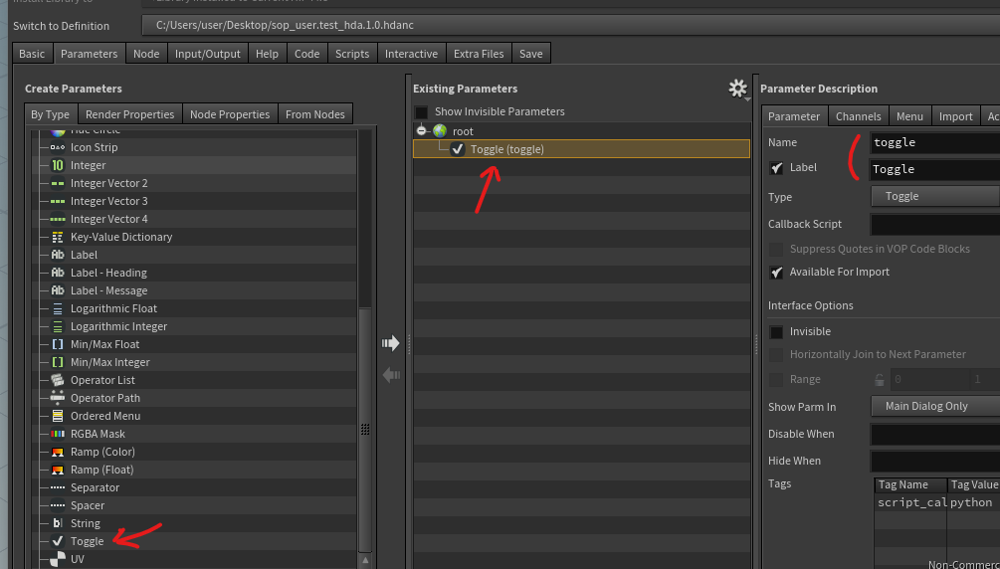
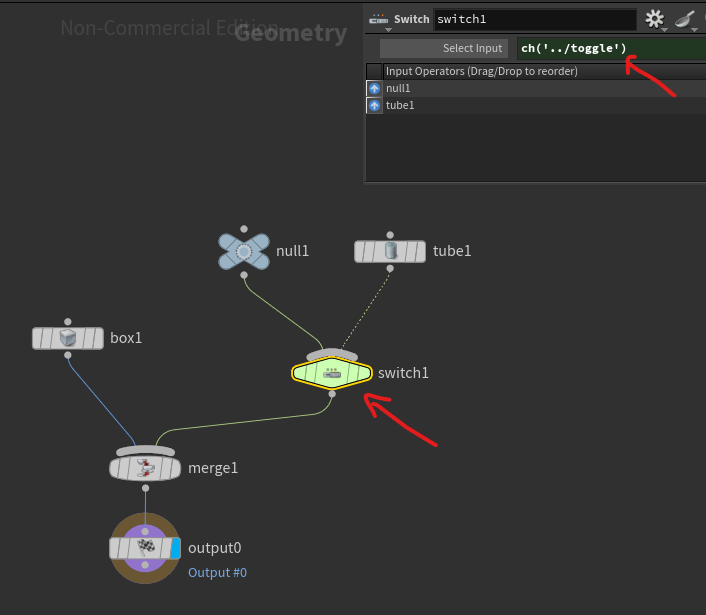

# How to use boolean parameter to control geometry

Usually most useful when creating an HDA, you can have a so-called `toggle` parameter (so a boolean state) :

In order to use that toggle to control whether a part of the graph is added or not, we can use the following trick :

On the first input of the switch we have a `null` node doing nothing and the second input we have the part of the graph that can potentially be merged.

Then we simply make the switch reference the `toggle` parameter to know which input to select.
